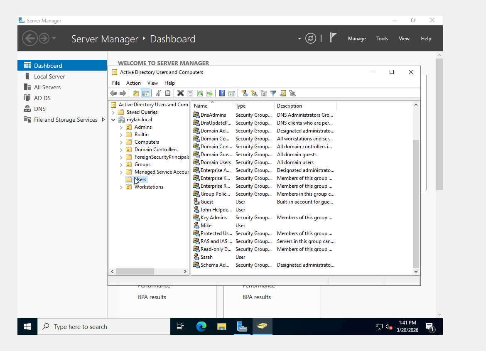
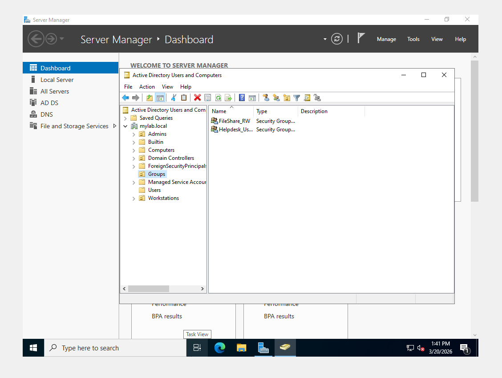

# Active Directory Home Lab
Windows Server 2022 | Windows 10 | VirtualBox | DNS | GPO | RSAT

---

## Contents
- Overview
- Environment
- Key Implementations
- Screenshots
- Walkthrough Summary
- Troubleshooting Experience
- Skills Demonstrated
- Next Steps
- Additional Documentation

---

## Overview
Built a virtualized Active Directory environment to simulate real-world helpdesk and junior system administration tasks. This lab focuses on identity management, access control, Group Policy, and troubleshooting common domain issues.

---

## Environment

- Hypervisor: VirtualBox  
- Domain Controller: Windows Server 2022  
- Client Machine: Windows 10  
- Domain: mylab.local  
- Core Services: Active Directory Domain Services (AD DS), DNS  
- Admin Tools: ADUC, Group Policy Management, DNS Manager, RSAT  

---

## Key Implementations

- Promoted Windows Server 2022 to a Domain Controller  
- Created and configured the mylab.local domain  
- Configured DNS with forwarders  
- Joined a Windows 10 client to the domain  
- Created users and security groups  
- Implemented group-based access control (RBAC)  
- Configured NTFS and share permissions  
- Created and applied a Workstation Lockdown GPO  
- Installed RSAT for remote administration  
- Delegated password reset permissions to helpdesk user (jhelpdesk)  

---

## Screenshots

### Domain Controller Login

  

<em>Windows Server 2022 Domain Controller login</em>

---

### Active Directory Users and Groups

  

<em>User account management in Active Directory</em>

  

<em>Security groups used for access control</em>

---

### Helpdesk Client Access

  

<em>Helpdesk user login on domain-joined workstation</em>

---

### Remote Administration (RSAT)

  

<em>Managing Active Directory remotely using RSAT</em>

---

### Shared Folder Permissions

  

<em>Share-level permissions configuration</em>

  

<em>NTFS permissions aligned with group-based access</em>

---

### Group Policy Configuration

  

<em>Workstation restrictions enforced using Group Policy</em>

---

## Walkthrough Summary

1. Deployed Windows Server 2022 and promoted it to a Domain Controller  
2. Configured DNS and validated name resolution  
3. Joined Windows 10 client to the domain  
4. Created users and security groups  
5. Implemented group-based file share access  
6. Applied Group Policy for workstation control  
7. Delegated password reset permissions to helpdesk user  
8. Troubleshot DNS, permissions, and network issues  

---

## Troubleshooting Experience

- DNS misconfiguration affecting domain join and authentication  
- VirtualBox networking issues preventing communication  
- NTFS and share permission conflicts  
- Group membership delays due to token refresh  
- Delegation misconfiguration for helpdesk permissions  

Full breakdown available here:  
docs/troubleshooting-log.md

---

## Skills Demonstrated

- Active Directory Administration  
- DNS Configuration and Troubleshooting  
- Group Policy Management (GPO)  
- Windows Domain Environments  
- NTFS and Share Permissions  
- Role-Based Access Control (RBAC)  
- RSAT and Remote Administration  
- IT Troubleshooting Methodology  

---

## Next Steps

- Implement Organizational Units (OUs) for departments  
- Apply multiple GPOs based on roles  
- Automate user creation with PowerShell  
- Deploy login scripts and mapped drives  
- Enable auditing and monitor event logs  

---

## Additional Documentation

- docs/troubleshooting-log.md
